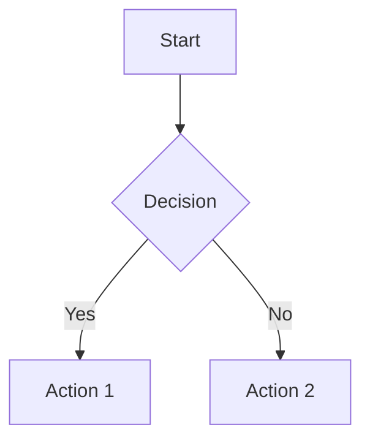
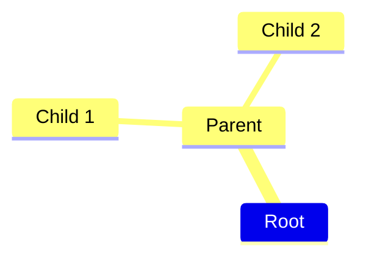

```` 
# Trigger: apply these instructions when the user or an edit mentions "mermaid" or "diagram(s)"

description: Whenever diagrams or mermaid is mentioned.
alwaysApply: false

# Mermaid instructions for GitHub Copilot

These are the rules Copilot should follow when generating Mermaid diagrams intended to render in GitHub Markdown.

## 1. Fenced code block

* Use a fenced code block that starts with `mermaid and ends with `.

## 2. Supported diagram types

* Prefer commonly supported types: `graph` (flowchart), `sequenceDiagram`, `classDiagram`, `stateDiagram-v2`, `erDiagram`, `pie`, `gantt`, `mindmap` (basic).
* Avoid very new/experimental Mermaid types or features.

## 3. Syntax rules

* Use simple alphanumeric node IDs (e.g., `node1`, `processA`). Avoid spaces and special characters in IDs.
* Always quote labels that contain spaces, punctuation, or special characters: `A["User Input"] --> B["Validate Data"];`.
* Use standard arrow tokens: `-->`, `---`, `==>`, `->>`.
* Use `%%` for comments.

## 4. Mindmap specifics (GitHub-compatible)

* Use indentation to represent hierarchy; ensure every node is on its own line.
* **Do not** use `::icon()` or other icon/emoji syntax — GitHub's Mermaid renderer does not support these and will fail.

## 5. Layout preference

* For flowcharts prefer `graph TD` (top-down) or `graph TB` (top-bottom) for readability.

## 6. Styling & themes

* **Do not** include `%%{init: ...}` theme blocks, custom `classDef`, or `style` directives. GitHub applies its own styles.

## 7. Keep diagrams focused

* Break very large/complex diagrams into smaller blocks. A single block should focus on one concept or flow.

## 8. Testing

* Always review the diagram in GitHub's Markdown preview after generation.
* If Copilot edited an existing Mermaid block, carefully review indentation and quoting.

## 9. Tooling notes

* Automated edits sometimes corrupt indentation or quoting inside Mermaid blocks. If a diagram doesn't render, check for missing backticks, unbalanced brackets, or unquoted labels.


# Examples (for reference)

**Flowchart (top-down):**



**Mindmap (basic, GitHub-compatible):**


