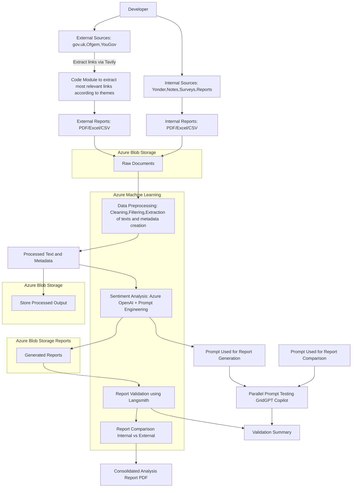

# Sentiment Analyser — Architecture Diagram

The diagram below shows a basic end-to-end workflow for a sentiment analysis tool.

```mermaid
flowchart TB

    DEV[Developer]

    EXT_SOURCES[External Sources: gov.uk,Ofgem,YouGov]
    INT_SOURCES[Internal Sources: Yonder,Notes,Surveys,Reports]

    DEV --> EXT_SOURCES
    DEV --> INT_SOURCES

    EXT_SOURCES -->|Extract links via Tavily| TAVILY[Code Module to extract most relevant links according to themes]
    TAVILY -->EXT_DOCS[External Reports: PDF/Excel/CSV]

    INT_SOURCES --> INT_DOCS[Internal Reports: PDF/Excel/CSV]

    subgraph BLOB1[Azure Blob Storage ]
        RAW_STORE[Raw Documents]
    end

    EXT_DOCS --> RAW_STORE
    INT_DOCS --> RAW_STORE

    %% Azure ML Block
    subgraph AML[Azure Machine Learning]
        PREPROC[Data Preprocessing: Cleaning,Filtering,Extraction of texts and metadata creation]
        SA[Sentiment Analysis: Azure OpenAI + Prompt Engineering]
        VALID[Report Validation using Langsmith]
        COMPARE[Report Comparison Internal vs External]
    end

    RAW_STORE --> PREPROC

    PROC_OUT[Processed Text and Metadata]
    PREPROC --> PROC_OUT

    subgraph BLOB2[Azure Blob Storage]
        FINAL_PROC_STORE[Store Processed Output]
    end
    PROC_OUT --> FINAL_PROC_STORE

    PROC_OUT --> SA

    PROMPT_USED1[Prompt Used for Report Generation]
    SA --> PROMPT_USED1
    PROMPT_USED2[Prompt Used for Report Comparison]

    subgraph BLOB3[Azure Blob Storage Reports]
        REPORT_STORE[Generated Reports]
    end

    SA --> REPORT_STORE

    REPORT_STORE --> VALID
    VAL_SUMMARY[Validation Summary]
    VALID --> VAL_SUMMARY

    GRIDGPT[Parallel Prompt Testing GridGPT Copilot]
    PROMPT_USED1 --> GRIDGPT
    PROMPT_USED2 --> GRIDGPT
    
    GRIDGPT --> VAL_SUMMARY

    VALID --> COMPARE


    FINAL_OUTPUT[Consolidated Analysis Report PDF]
    COMPARE --> FINAL_OUTPUT

```
