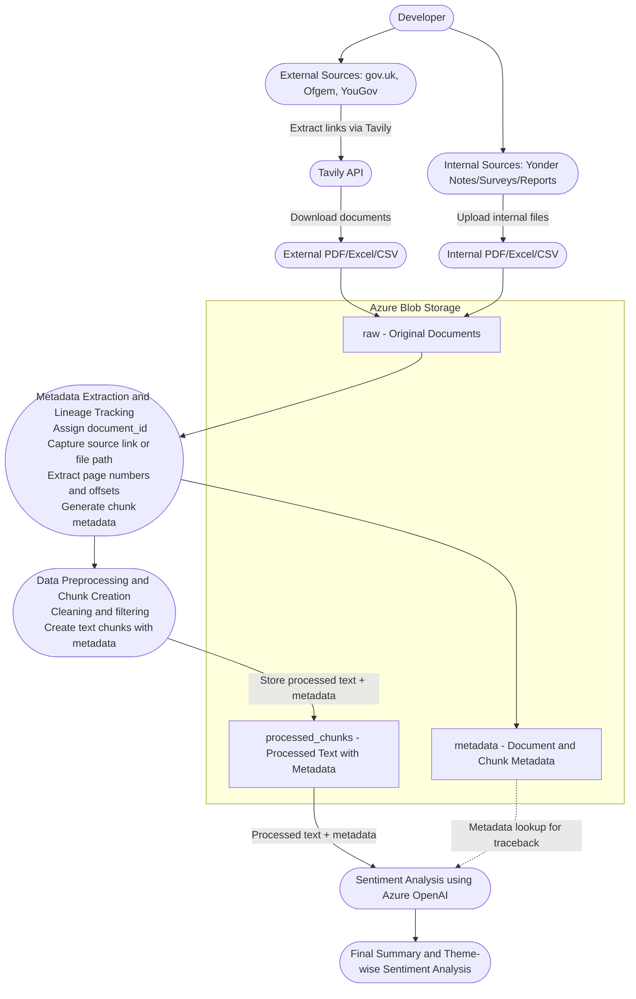

# Sentiment Analyser — Architecture Diagram

The diagram below shows a basic end-to-end workflow for a sentiment analysis tool. Preview this file on GitHub to see the rendered Mermaid diagram.

Notes:
- **API / UI**: Accepts text from users or batch ingestion, returns sentiment label and score.
- **Preprocessing**: Typical steps include cleaning, tokenization, lowercasing, stopword removal.
- **Feature Extraction**: Could be classic (TF-IDF) or modern embeddings (BERT, sentence-transformers).
- **Model**: Handles both training and inference. Models and artifacts should be versioned in a registry.
- **Monitoring & Feedback**: Collects metrics and user feedback to enable retraining and improvements.

Preview tip: open this file on GitHub and use the Markdown preview to render the Mermaid diagram.
